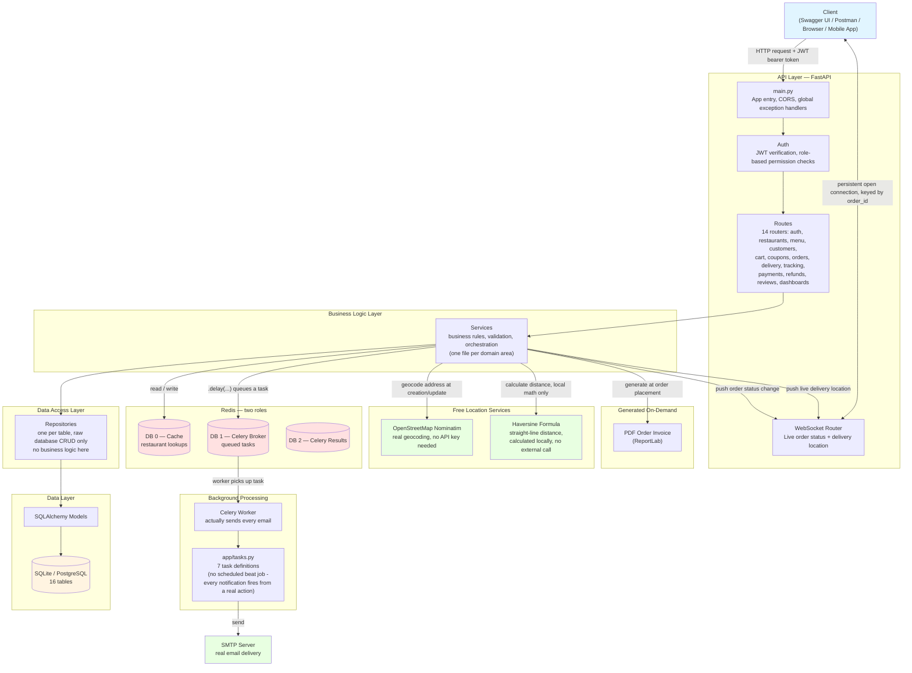

# Architecture Diagram — Restaurant & Food Delivery Management System

This shows how a request actually travels through the whole system, layer by
layer, plus how background processing (Celery), live updates (WebSocket), and
real location data (OpenStreetMap Nominatim) fit in. GitHub renders this
automatically — no separate image needed.

---

## What each layer actually does, in plain words

**Client** — Swagger, Postman, or any real frontend. Sends a normal HTTP
request with a JWT token attached, or opens a WebSocket connection to watch a
specific order live.

**`main.py`** — the very first thing every request hits. Handles CORS, and
catches any error anywhere in the app, turning it into a clean, consistent
JSON response instead of a raw crash.

**Auth** — checks the JWT token is genuine and not expired, and figures out
which role the person is (Admin, Restaurant Owner, Restaurant Staff, Delivery
Partner, or Customer) — every route then decides whether that specific role
is allowed in.

**Routes** — the actual URL endpoints (`POST /api/v1/orders`, etc.). Their
only job is receiving the request and handing it straight to the matching
service — no real logic lives here.

**Services** — this is where the actual thinking happens: every business rule
in this whole project (one-restaurant-per-cart, automatic total calculation,
coupon validation, availability checks, delivery-partner conflict
prevention) lives here.

**Repositories** — the layer whose *only* job is talking to the database —
fetch a row, save a row. No business rules, no validation, nothing else.

**Models** — the SQLAlchemy classes describing what each table actually looks
like.

**Redis, two roles this time** — genuinely one Redis server, using 3 of its
numbered storage slots: caching restaurant reads, holding Celery's task
queue, and holding Celery's task results. Worth noting this project's Redis
usage is lighter than others — Restaurant is the only entity cached, since
menu items and orders change too frequently to benefit from caching the same
way.

**Celery Worker** — the process that actually sends every real email in this
system. Worth flagging clearly: **there's no Celery Beat process for this
project**, unlike some others — every single notification here fires as a
direct result of a real action happening right now (an order placed, a
status changed), not a recurring, clock-triggered check.

**OpenStreetMap Nominatim** — a real, free, external geocoding service.
Converts a typed address into real latitude/longitude coordinates, no API key
or billing account needed at all, just a respected 1-request-per-second rate
limit.

**Haversine Formula** — genuinely not an external service at all, just real
math running locally inside the app, calculating straight-line distance
between two coordinate points. The one honest trade-off for staying fully
free: this gives real distance, not real driving distance or traffic-aware
time.

**PDF generation** — happens synchronously, directly inside the request
itself (not through Celery), the moment an order is placed — fast enough that
there's no need to queue it.

**WebSocket, genuinely doing double duty** — one connection type, keyed by
`order_id`, but broadcasting 2 different kinds of live updates: order status
changes (submit, accept, prepare, deliver) *and* the delivery partner's live
location as they physically move, once they're actively delivering that
specific order.

---

## A concrete example — what happens when a customer places an order

1. Customer calls `POST /orders`, with their chosen address and an optional coupon code
2. **Routes** hands this straight to **Services**
3. **`order_service`** reads the customer's own **Cart** (through the
   **Repository**, from the **Database**), checks the restaurant is
   genuinely open, checks every item is still available
4. If a coupon was provided, it's validated (through `coupon_service`) —
   expiry, minimum order value, usage limit, and duplicate-use, all checked
   together
5. The real total is calculated: `subtotal + tax + delivery fee − discount`
6. Each cart item's real name and price gets locked in permanently as a new
   **Order Item** — a snapshot that never changes later, even if the menu
   does
7. The cart is cleared
8. A **PDF invoice** is generated immediately, right there in the request
9. An order confirmation email gets queued into **Redis (DB 1)**
10. A live update gets pushed through the **WebSocket** connection for this
    `order_id`, if anyone happens to be watching it
11. The API responds to the customer **immediately** — it doesn't wait for
    the email to actually send
12. Moments later, the **Celery Worker**, running as a completely separate
    process, picks up the queued email task and actually sends it through the
    real **SMTP server**

## How to view this diagram

- **On GitHub:** opens automatically when viewing this file in your
  repository
- **Locally:** paste the code block into [mermaid.live](https://mermaid.live)
  to preview or export it as an image