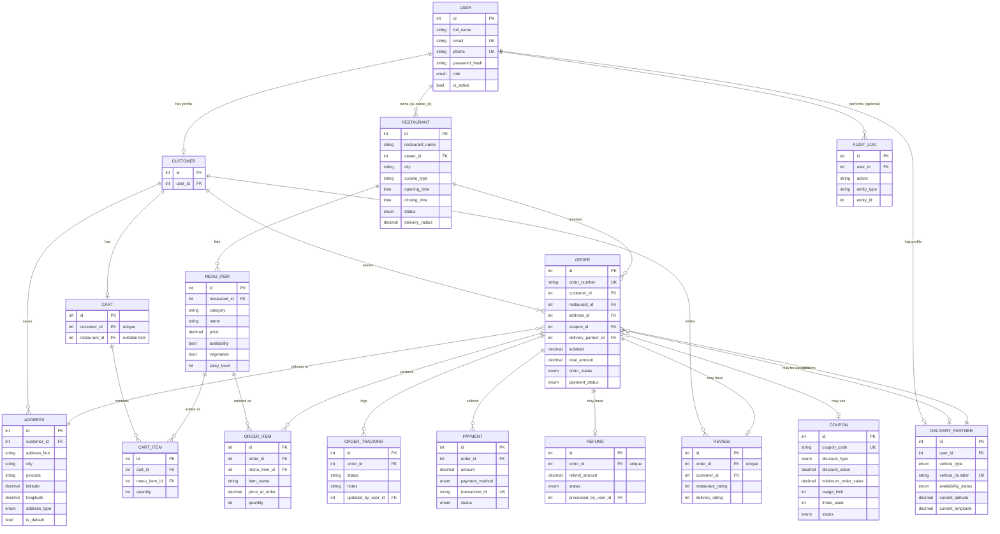

# ER Diagram — Restaurant & Food Delivery Management System

This diagram shows all 16 tables and how they connect. GitHub renders this
automatically when viewing this file in a repository — no separate image or
tool needed. Full field lists for every table are in `app/models/` and the
Alembic migration file.

---

## Relationships explained in plain words

- **One User can have one Customer profile, and separately, one Delivery
  Partner profile** — a single account only ever holds one of these, matching
  its role, but the schema itself allows both relationships from `User`.
- **One User (a Restaurant Owner) can own many Restaurants.**
- **One Customer can save many Addresses, has exactly one Cart, places many
  Orders, and writes many Reviews.**
- **One Restaurant lists many Menu Items, and receives many Orders.**
- **One Cart contains many Cart Items** — but the Cart itself locks to a
  single Restaurant the moment its first item is added, released again once
  it's emptied.
- **One Order branches into several things:** many Order Items (a permanent,
  locked-in snapshot of name and price — never recalculated later), many
  Order Tracking entries (its full status history), many Payments, and at
  most **one** Refund and at most **one** Review — both enforced by a real
  `unique` constraint on `order_id`, not just application logic.
- **An Order optionally uses one Coupon**, and optionally has one Delivery
  Partner assigned — both genuinely optional, since not every order needs a
  discount, and assignment happens as a separate step after the order is
  placed.
- **One Delivery Partner delivers many Orders** over time, though only ever
  one *active* one at a time (enforced through their `availability_status`,
  not a database constraint).
- **Audit Log entries optionally point back to whichever User performed the
  action** — optional so the log entry survives even if that user's account
  is later removed.

## How to view this diagram

- **On GitHub:** just open this file in your repository — it renders
  automatically, no setup needed.
- **Locally, before pushing:** paste the code block above (without the triple
  backticks) into [mermaid.live](https://mermaid.live) to preview it instantly.